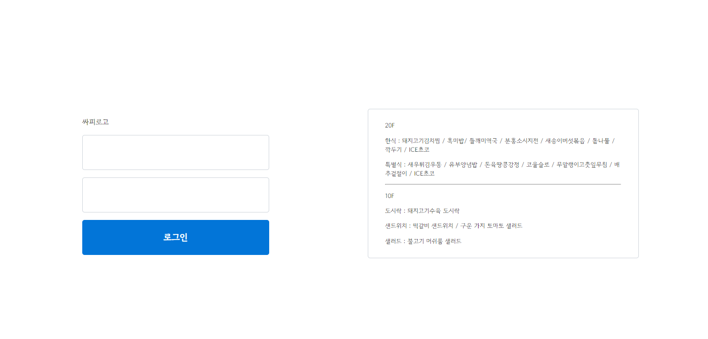
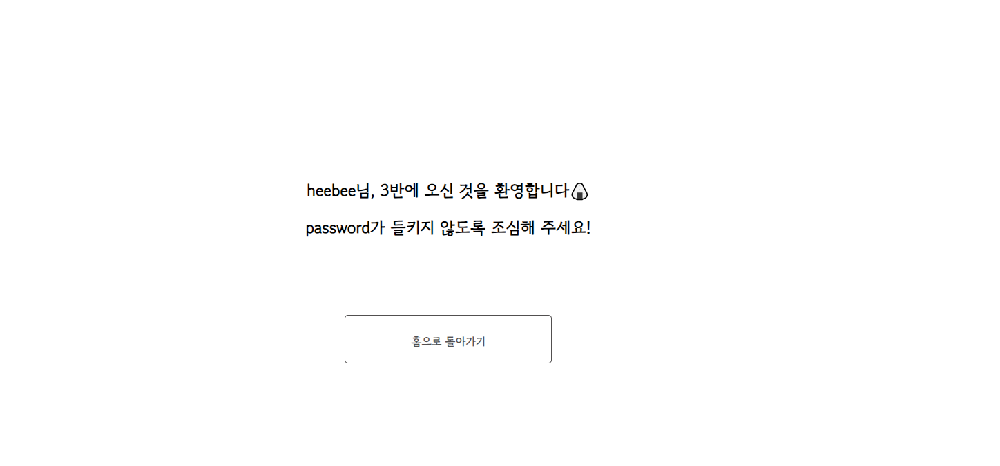

> # SSAFY-YAM

>> ## 과제 개요
>> DB에 저장된 급식 정보를 확인하고 로그인 성공 화면 조회

>>> ### 개발 기간
>>> - 2024-03-20 ~ 2024 -04-03

>>> ### 참여 인원
>>> |  Backend  | Frontend |
>>> | --------- | ---------|
>>> |   최희현  |  황은비   |


>>> ### 실행 환경 
>>> |   TECH    | Version  |
>>> | --------- | ---------|
>>> |   Python  |  3.9.13  |
>>> |   Django  |  4.2.11  |


>>> ### TECH
>>> #### Backend
>>> 

>>> #### Frontend
>>> 

>>> ### 사용 방법
>>> ```python
>>> 1. 가상환경에서 필수 라이브러리 설치
>>> pip install -r requirements.txt
>>> 2. DB 마이그레이션
>>> python manage.py makemigrations
>>> python manage.py migrate
>>> 3. 서버 실행
>>> python manage.py runserver
>>> ```


>> ## 주요 기능
>>> ### 실행 화면
>>> #### 메인 페이지
>>> 
>>> #### 로그인 성공 페이지
>>> 
>>> ### 구현 내용
>>> #### BE
>>> - Django의 MTV 패턴을 활용하여 급식정보를 반환
>>> - form action request에 대해 적절한 페이지로 id, password를 response로 보내기
>>> #### FE
>>> - django의 templates 폴더에 화면을 구성
